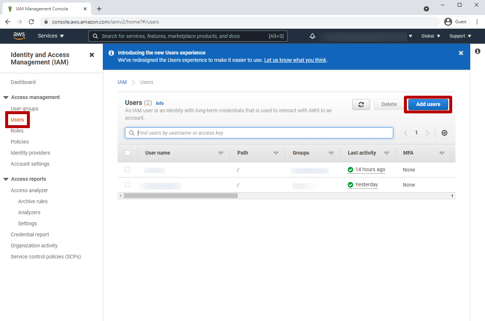
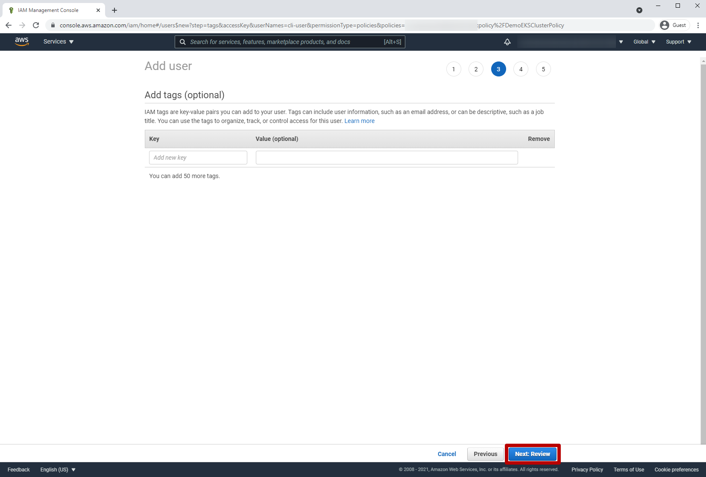
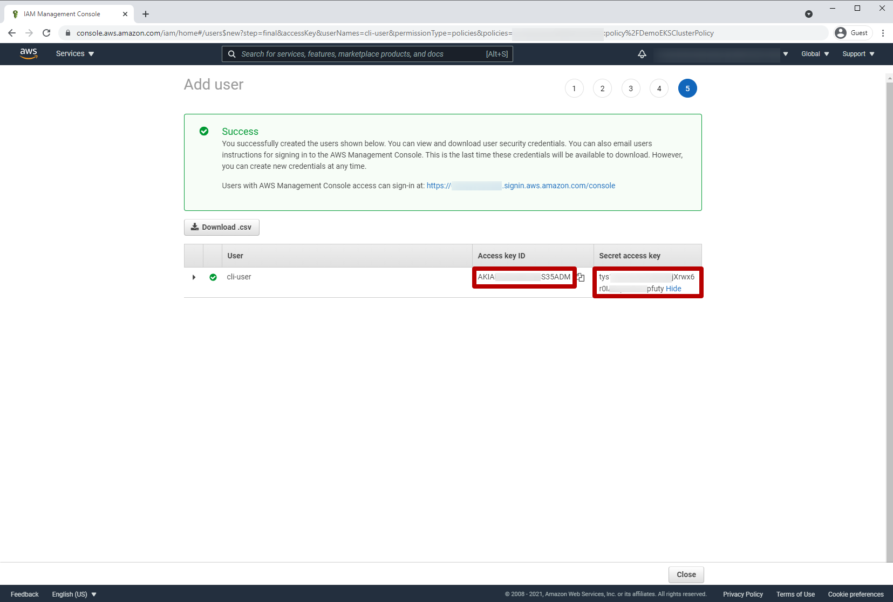

update kubeconfig for kubectl
aws eks update-kubeconfig --region eu-west-2 --name education-eks-DPP2hvMh

Pre-Requisites
###############

kubectl
AWS Account
aws cli
terraform

volterra account

Lab Environment Setup  
############################### 

1. AWS CLI
*************************** 
Open IAM => Users

.. figure:: _figures/aws_cli_config_1.png

.. figure:: _figures/aws_cli_config_1_2.png

.. figure:: _figures/aws_cli_config_1_3.png

.. figure:: _figures/aws_cli_config_1_5.png

.. figure:: _figures/aws_cli_config_2.png

.. figure:: _figures/aws_cli_config_4.png

.. figure:: _figures/aws_cli_config_5.png

.. figure:: _figures/aws_cli_config_7.png

.. figure:: _figures/aws_cli_config_9.png

deploy kubectl to AWS

cd terraform
terraform init
terraform plan
terraform apply

.. figure:: _figures/eks_setup_1.png

.. figure:: _figures/eks_setup_2.png

.. figure:: _figures/eks_setup_3.png

.. figure:: _figures/eks_setup_4.png

Connect EKS Cluster
##################### 

In order to connect EKS cluster, we'll follow a few steps. First, we'll need to generate a site token, which is used among a few other things to deploy and configure a K8s cluster as a Volterra Site. Then we'll update the manifest with the generated token, and, finally, we'll deploy it.

1. Create token
***************

`a)` Log in the VoltConsole and go to the **System** namespace.  Then navigate to **Site Management** in the configuration menu, and select **Site Tokens** from the options pane.

.. figure:: _figures/connect_eks_cluster_1.png

`b)` Click **Add site token** to open the form and create a new token.

.. figure:: _figures/connect_eks_cluster_2.png

`c)` Then enter the site name. Description field is optional. Click **Add site token** button at the bottom of the form. 

.. figure:: _figures/connect_eks_cluster_3.png

`d)` Copy the token UID to use it for the manifest file in the next step.

.. figure:: _figures/connect_eks_cluster_4.png

2. Update manifest
*******************

Download the sample  `Manifest Template <https://gitlab.com/volterra.io/volterra-ce/-/blob/master/k8s/ce_k8s.yml>`_  and open it. Paste the token generated in the previous step and save the file. The edited manifest will later be applied to spawn a Volterra Site as a pod on the EKS cluster.

.. figure:: _figures/connect_eks_cluster_5.png

3. Deploy manifest
*******************

Open the console and run the following command: **kubectl apply –f volterra-k8s-manifest.yaml**. This deploys the site using the created manifest file.

.. figure:: _figures/connect_eks_cluster_6.png

4. Accept registration
*******************

The Site we just configured will show up as a new registration request in the VoltConsole. We now need to approve the registration request for the site.

`a)` Go back to the VoltConsole, the **System** namespace. Navigate to the **Site Management** menu option to accept the pending registration. Select **Registrations** from the options pane. You will see your site in the displayed list. 

.. figure:: _figures/connect_eks_cluster_7.png

`b)` Click the tick to load the **Registration Acceptance** form.

.. figure:: _figures/connect_eks_cluster_8.png

`c)` Click the **Save and Exit** button to save the registration.

.. figure:: _figures/connect_eks_cluster_9.png

5. Check status
*******************

We have now configured our Site, so let's see its status, including health score. Go to the **Site List** tab and you’ll see the dashboard of your site.

**Note**: It may take a few minutes for the health and connectivity status to get updated in the portal.

Create VK8S Cluster
##################### 

1. Create cluster

.. figure:: _figures/create_vk8s_1.png

.. figure:: _figures/create_vk8s_4.png

2. download kubeconfig

.. figure:: _figures/create_vk8s_5.png

.. figure:: _figures/create_vk8s_6.png

.. figure:: _figures/create_vk8s_7.png

.. figure:: _figures/create_vk8s_8.png

.. figure:: _figures/create_vk8s_9.png

3. check connection

kubectl --kubeconfig ./ves_default_vk8s.yaml cluster-info

.. figure:: _figures/create_vk8s_10.png

Deploy resources to Volterra Edge
##################### 

1. deploy resources

-- TBD

2. Create internal load balancer

.. figure:: _figures/backend_lb_1.png

.. figure:: _figures/backend_lb_2.png

.. figure:: _figures/backend_lb_3.png

.. figure:: _figures/backend_lb_4.png

.. figure:: _figures/backend_lb_5.png

.. figure:: _figures/backend_lb_6.png

.. figure:: _figures/backend_lb_7.png

.. figure:: _figures/backend_lb_8.png

.. figure:: _figures/backend_lb_9.png

3. create public load balancer

.. figure:: _figures/frontend_lb_1.png

.. figure:: _figures/frontend_lb_2.png

.. figure:: _figures/frontend_lb_3.png

.. figure:: _figures/frontend_lb_4.png

.. figure:: _figures/frontend_lb_5.png

.. figure:: _figures/frontend_lb_6.png

.. figure:: _figures/frontend_lb_7.png

.. figure:: _figures/frontend_lb_8.png

4. check connection from web

.. figure:: _figures/frontend_lb_9.png
