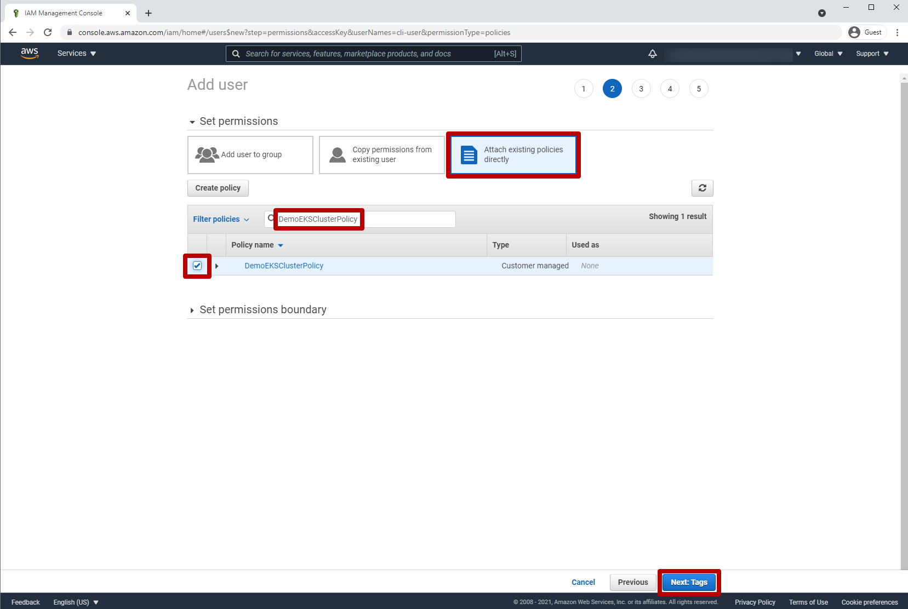
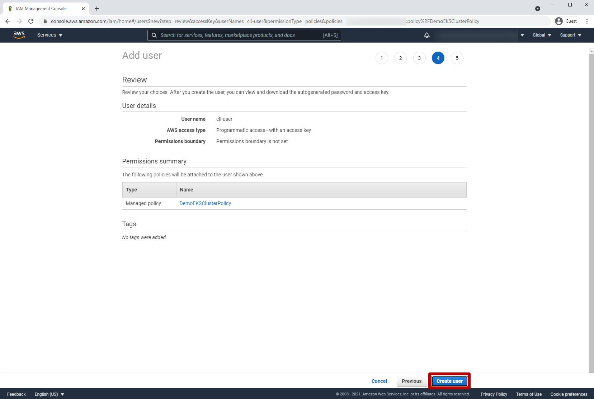
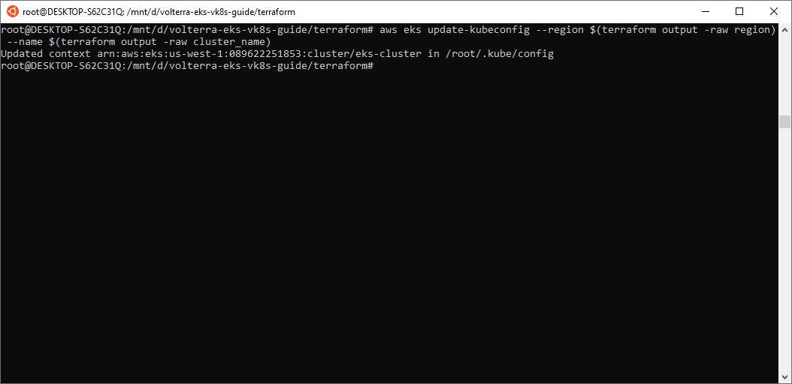
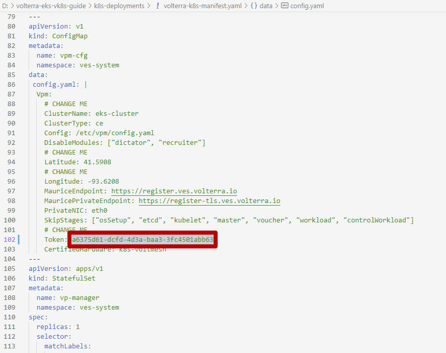
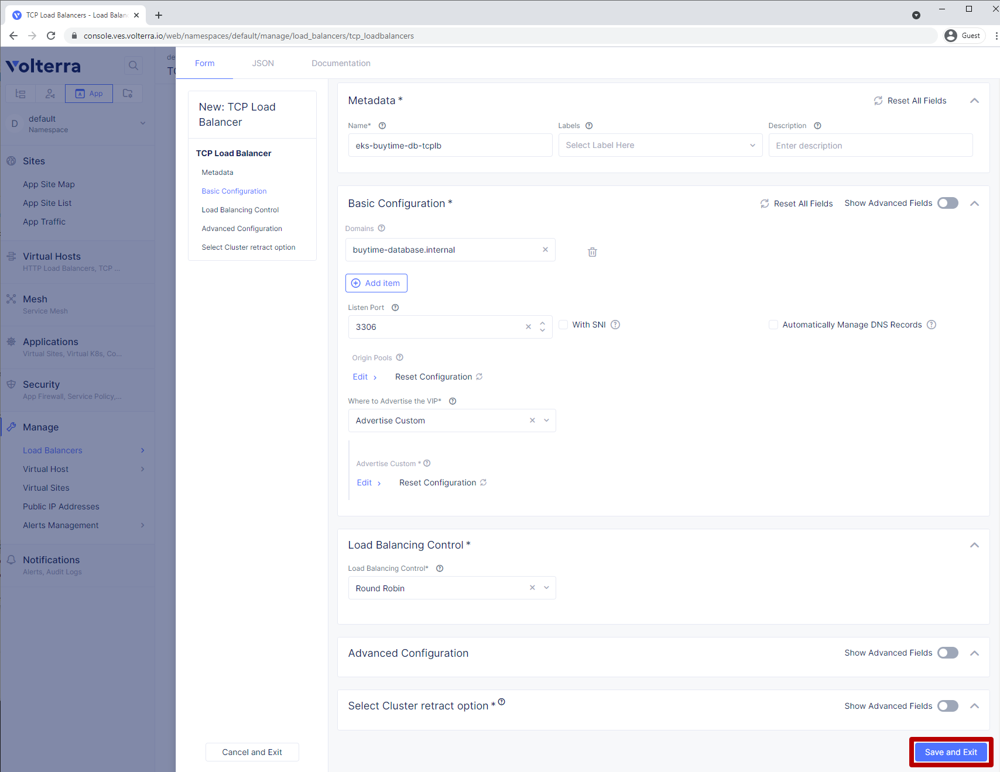

volterra-eks-vk8s-lab
==================================================

.. contents:: Table of Contents

Pre-Requisites
###############

- AWS Account
- aws cli
- terraform
- kubectl
- volterra account

.. figure:: _figures/overview.png

Lab Environment Setup  
############################### 

1. AWS CLI
*************************** 
Open IAM => Users

.. figure:: _figures/aws_cli_config_1.png

.. figure:: _figures/aws_cli_config_1_2.png

.. figure:: _figures/aws_cli_config_1_4.png

.. figure:: _figures/aws_cli_config_1_5.png

.. figure:: _figures/aws_cli_config_2.png

.. figure:: _figures/aws_cli_config_3.png

.. figure:: _figures/aws_cli_config_4.png

.. figure:: _figures/aws_cli_config_6.png

.. figure:: _figures/aws_cli_config_8.png

.. figure:: _figures/aws_cli_config_9.png

deploy kubectl to AWS

cd terraform
terraform init
terraform plan
terraform apply

.. figure:: _figures/eks_setup_1.png

.. figure:: _figures/eks_setup_2.png

.. figure:: _figures/eks_setup_3.png

Connect EKS Cluster
##################### 

In order to connect EKS cluster, we'll follow a few steps. First, we'll need to generate a site token, which is used among a few other things to deploy and configure a K8s cluster as a Volterra Site. Then we'll update the manifest with the generated token, and, finally, we'll deploy it.

1. Create token
***************

`a)` Log in the VoltConsole and go to the **System** namespace.  Then navigate to **Site Management** in the configuration menu, and select **Site Tokens** from the options pane.

.. figure:: _figures/connect_eks_cluster_1.png

`b)` Click **Add site token** to open the form and create a new token.

.. figure:: _figures/connect_eks_cluster_2.png

`c)` Then enter the site name. Description field is optional. Click **Add site token** button at the bottom of the form. 

.. figure:: _figures/connect_eks_cluster_3.png

`d)` Copy the token UID to use it for the manifest file in the next step.

.. figure:: _figures/connect_eks_cluster_4.png

2. Update manifest
*******************

Download the sample  `Manifest Template <https://gitlab.com/volterra.io/volterra-ce/-/blob/master/k8s/ce_k8s.yml>`_  and open it. Paste the token generated in the previous step and save the file. The edited manifest will later be applied to spawn a Volterra Site as a pod on the EKS cluster.

3. Deploy manifest
*******************

Open the console and run the following command: **kubectl apply –f volterra-k8s-manifest.yaml**. This deploys the site using the created manifest file.

.. figure:: _figures/connect_eks_cluster_6.png

4. Accept registration
*******************

The Site we just configured will show up as a new registration request in the VoltConsole. We now need to approve the registration request for the site.

`a)` Go back to the VoltConsole, the **System** tab. Navigate to the **Site Management** menu option to accept the pending registration. Select **Registrations** from the options pane. You will see your site in the displayed list. 

`b)` Click the tick to load the **Registration Acceptance** form.

.. figure:: _figures/connect_eks_cluster_8.png

`c)` Click the **Save and Exit** button to save the registration.

5. Check status
*******************

We have now configured our Site, so let's see its status, including health score. Go to the **Site List** tab and you’ll see the dashboard of your site. In the screenshot below, we can see that the site is up and running, with 100% health score. 

.. figure:: _figures/connect_eks_cluster_10.png

**Note**: It may take a few minutes for the health and connectivity status to get updated in the portal.

Create VK8S Cluster
##################### 

Volterra provides mechanism to easily deploy applications using vK8s across Volterra global network and make them available closer to users. Virtual Kubernetes (vK8s) clusters are fully-functional Kubernetes deployments that can span multiple geographic regions, clouds, and even on-prem environments. Let's now follow a few steps below to create a vK8s object in VoltConsole, associate with a virtual site that groups Volterra sites, download kubeconfig of the created vK8s and test connectivity.

1. Create cluster
*******************

`a)` Select **Applications** tab and then navigate to **Virtual K8s** from the configuration menu. Click **Add virtual K8s** to create a vK8s object.

.. figure:: _figures/create_vk8s_1.png

`b)` Let's now give the vK8s a name and then move on to **Select Vsite Ref**: the virtual-site reference of locations on the Volterra network where vK8s will be instantiated. We will use the default virtual-site for our vK8s.

.. figure:: _figures/create_vk8s_2.png

`c)` Check the box just next to **ves-io-all-res** to associates the virtual site that selects all Volterra network cloud sites, and click **Select Vsite Ref**.

.. figure:: _figures/create_vk8s_3.png

`d)` Continue to apply the virtual site to the vK8s configuration. Click **Save and Exit** to complete creating the vK8s clusters in all Volterra Regional Edge (RE) sites.

.. figure:: _figures/create_vk8s_4.png

The process of creating a vK8s cluster takes just a minute, and after that you will be all set to deploy and distribute app workloads onto this new infrastructure.

2. Download Kubeconfig
**********************

We will now need a kubeconfig file for our cluster. Kubeconfig stores information about clusters, users, namespaces, and authentication mechanisms. We will download the Kubeconfig entering the certificate expiry date when prompted. 

`a)` Open the dropdown menu by clicking three dots and start downloading Kubeconfig. 

.. figure:: _figures/create_vk8s_5.png

`b)` Open the calendar and select the expiry date. 

.. figure:: _figures/create_vk8s_6.png

`c)` Click **Download credential** to start the download.

.. figure:: _figures/create_vk8s_7.png

`d)` As you can see, Kubeconfig is downloaded. 

.. figure:: _figures/create_vk8s_8.png

`e)` Copy the downloaded Kubeconfig into the **k8s deployments** folder.

.. figure:: _figures/create_vk8s_9.png

3. Check connection
**********************

Open CLI, and run the following command **kubectl --kubeconfig ./ves_default_vk8s.yaml cluster-info** to test if the created vK8s cluster is connected. If it's successfully accomplished, the output will show that it's running at Volterra.  

.. figure:: _figures/create_vk8s_10.png

Deploy resources to Volterra Edge
##################### 

After vK8s cluster has been created and tested, we can deploy our app's resources to Volterra Edge. We are going to locate frond end in Volterra Edge. Then we'll create internal TCP and public HTTP load balancers, connecting Volterra with k8s cluster (with app's backend), and Volterra with the internet, respectively. Then we will test if the resources are successfully deployed to Volterra Edge. 

1. Deploy resources
**********************

-- TBD

2. Create internal load balancer
********************************

First of all, let's create an internal TCP load balancer, then add and configure an origin pool. Origin pools consist of endpoints and clusters, as well as routes and advertise policies that are required to make the application available to the internet. 

`a)` In the **Application** tab, navigate to **Load Balancers** and then select **TCP Load Balancers** in the options. Then click **Add TCP Load Balancer** to open the load balancer creation form.

`b)`Enter a name for the TCP load balancer in the Metadata section, and domain that will be matched to this balancer. A domain can be delegated to Volterra, so that Domain Name Service (DNS) entries can be created quickly in order to deploy and route traffic to our workload within seconds. Then fill in listen port **3306** for the TCP proxy, and move on to creating origin pool that will be used for this load balancer by clicling **Configure** origin pools.

.. figure:: _figures/tcplb_mysql_2.png

`c)`

.. figure:: _figures/tcplb_mysql_3.png

`d)`

.. figure:: _figures/tcplb_mysql_4.png

`e)`

.. figure:: _figures/tcplb_mysql_5.png

`f)`

.. figure:: _figures/tcplb_mysql_6.png

`g)`

.. figure:: _figures/tcplb_mysql_7.png

`h)`

`i)`

3. create public load balancer
**********************

.. figure:: _figures/frontend_lb_1.png

.. figure:: _figures/frontend_lb_2.png

.. figure:: _figures/frontend_lb_3.png

.. figure:: _figures/frontend_lb_4.png

.. figure:: _figures/frontend_lb_5.png

.. figure:: _figures/frontend_lb_6.png

.. figure:: _figures/frontend_lb_7.png

.. figure:: _figures/frontend_lb_8.png

4. check connection from web
**********************

.. figure:: _figures/frontend_lb_9.png
